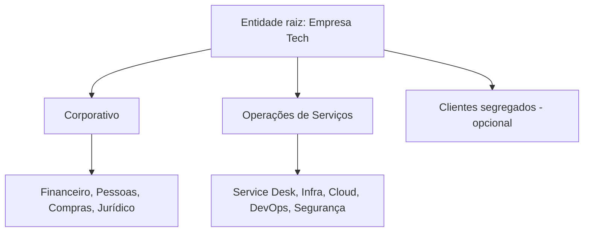

# GLPI 11 Enterprise Blueprint

Documentação pública de referência para implantação do **GLPI 11** em uma empresa de médio porte cujo negócio principal é a prestação de serviços de tecnologia.

O projeto trata o GLPI como uma plataforma corporativa de serviços, cobrindo TI, Segurança, DevOps, Operações, Financeiro, Pessoas, Compras, Jurídico, Comercial, Customer Success, PMO, Facilities e Marketing.

## Conteúdo

- arquitetura de entidades, grupos e perfis;
- catálogo corporativo de serviços;
- formulários, regras, filas, aprovações, SLAs e OLAs;
- incidentes, requisições, problemas e mudanças;
- inventário, ativos, contratos, fornecedores e licenças;
- onboarding, movimentação e offboarding;
- segurança, LGPD, testes e operação contínua;
- fluxos em Mermaid;
- modelos de documentação e implantação.

## Princípio de arquitetura

Use **entidades** para isolamento real — empresas do grupo, unidades segregadas ou clientes que não podem visualizar dados uns dos outros. Use **grupos** para departamentos, equipes, filas e responsabilidades operacionais.

## Publicação

O repositório utiliza MkDocs Material e GitHub Pages. A documentação é publicada automaticamente pelo workflow em `.github/workflows/docs.yml`.

## Segurança da documentação pública

Não publique nomes reais de clientes, credenciais, tokens, URLs internas, IPs, contratos, dados pessoais, números de chamados, serial numbers ou prints de produção.

## Referências oficiais

- https://help.glpi-project.org/documentation
- https://glpi-install.readthedocs.io/en/latest/
- https://github.com/glpi-project/glpi
- https://glpi-agent.readthedocs.io/
