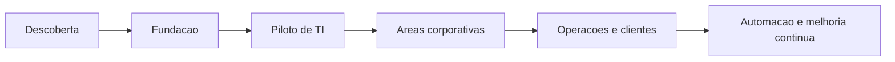

# Roadmap

## Fases

1. Levantar areas, servicos, canais, sistemas e SLAs.
2. Preparar infraestrutura, autenticacao, entidades, grupos e perfis.
3. Implantar TI, inventario, base de conhecimento e indicadores.
4. Expandir para Pessoas, Financeiro, Compras, Juridico, Facilities e Marketing.
5. Estruturar clientes, contratos, OLAs e operacoes 24x7 quando aplicavel.
6. Integrar diretorio, ERP, CRM, monitoramento, pipelines e APIs.
