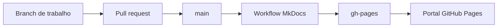

# Publicação no GitHub Pages

## Fluxo oficial

A branch `main` é a fonte oficial da documentação. Toda alteração destinada ao portal público deve ser revisada e incorporada à `main`.

O workflow `.github/workflows/docs.yml` é executado após cada push na `main`. Ele valida o projeto MkDocs, gera os arquivos HTML e publica o resultado na branch `gh-pages`.

## Papel de cada branch

| Branch | Finalidade | Reflete no portal? |
|---|---|---|
| `main` | Fonte oficial dos arquivos Markdown, configuração e workflow | Sim, após a execução do workflow |
| `gh-pages` | Resultado HTML gerado automaticamente pelo MkDocs | É o conteúdo servido pelo GitHub Pages |
| branches de implementação | Desenvolvimento, revisão e homologação documental | Não, até serem incorporadas à `main` |

A branch `gh-pages` não deve ser editada manualmente. Cada publicação substitui seu conteúdo pelo resultado atual da documentação existente na `main`.

## Conteúdo publicado

O portal deve refletir tudo que estiver referenciado no arquivo `mkdocs.yml`, incluindo:

- visão geral e arquitetura;
- implantação com Docker ou on-premises;
- configuração funcional do GLPI;
- catálogo e processos transversais;
- fluxos de TI, Segurança, DevOps e Operações;
- Financeiro, Pessoas, Compras e Jurídico;
- Comercial, Customer Success, PMO, Facilities e Marketing.

## Validação

Antes da publicação, o workflow executa uma construção estrita do MkDocs. A publicação deve falhar quando houver página ausente, referência inválida ou erro estrutural detectável pelo MkDocs.

Após a publicação, valide a página inicial, a navegação, a pesquisa e ao menos uma página de cada grupo de áreas.