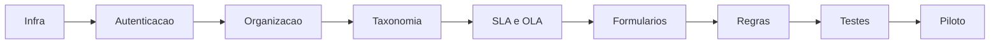

# Ordem de implementacao

1. Infraestrutura e seguranca.
2. Autenticacao.
3. Entidades, grupos e perfis.
4. Usuarios e calendarios.
5. Taxonomia e categorias.
6. Templates de ticket, tarefa e solucao.
7. SLAs e OLAs.
8. Notificacoes e acoes automaticas.
9. Catalogo e formularios.
10. Regras de negocio.
11. Inventario e ativos.
12. Relatorios e integracoes.
13. Testes, piloto e producao.

