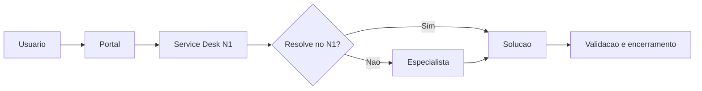

# TI e Service Desk

## Catalogo inicial

- incidente de hardware ou software
- solicitacao de equipamento
- instalacao de software
- acesso ou alteracao de perfil
- rede, VPN ou Wi-Fi
- conta, grupo ou caixa compartilhada

## Fluxo

## Configuracao

1. Crie grupos N1, Infra, Redes, IAM, Workplace e Aplicacoes.
2. Crie formularios por servico de maior volume.
3. Defina prioridade por impacto e urgencia.
4. Configure aprovacao para privilegios, ativos e software pago.
5. Associe SLA e OLA.
6. Crie modelos de tarefa e solucao.
7. Meça FCR, MTTA, MTTR, backlog, reabertura, SLA e satisfacao.
